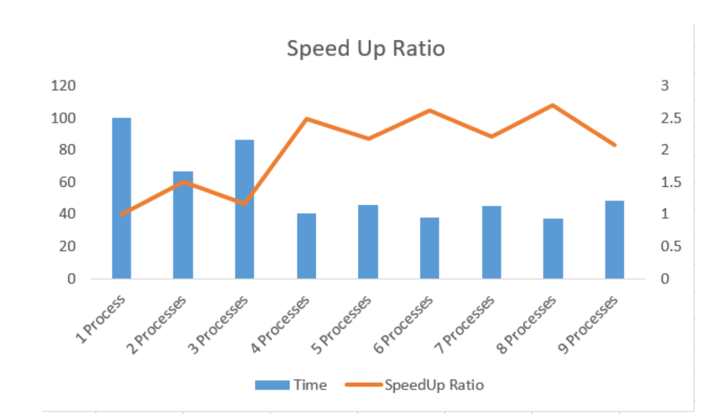

# Parallel Computing Practices in C++

This is a project set that contains four mini projects involving parallel computing technologies in C++. All of them are initially written with MPI, but then I added
pthread to test multi-threading in C++ as well.


### Installation / Setup
Installing MPI
1. Go to https://www.open-mpi.org/software/ompi/v2.0/
2. ``` cd openmpi-2.0.2```
3. ```./configure --prefix=$HOME/opt/usr/local``` to pre-install configure
4. ``` make all```
5. ``` make install ```
6. ```$HOME/opt/usr/local/bin/mpirun --version```

Check if it outputs the version number.

If so, you have successfully installed MPI.

### Visualizations for Part 2,3,4
#### Part 2: 

Mandelbrot result


Performance analysis:


#### Part 3:
Multi-star system:


Performance analysis:


#### Part 4:
Hear-transfer system:
 

Performance analysis:


